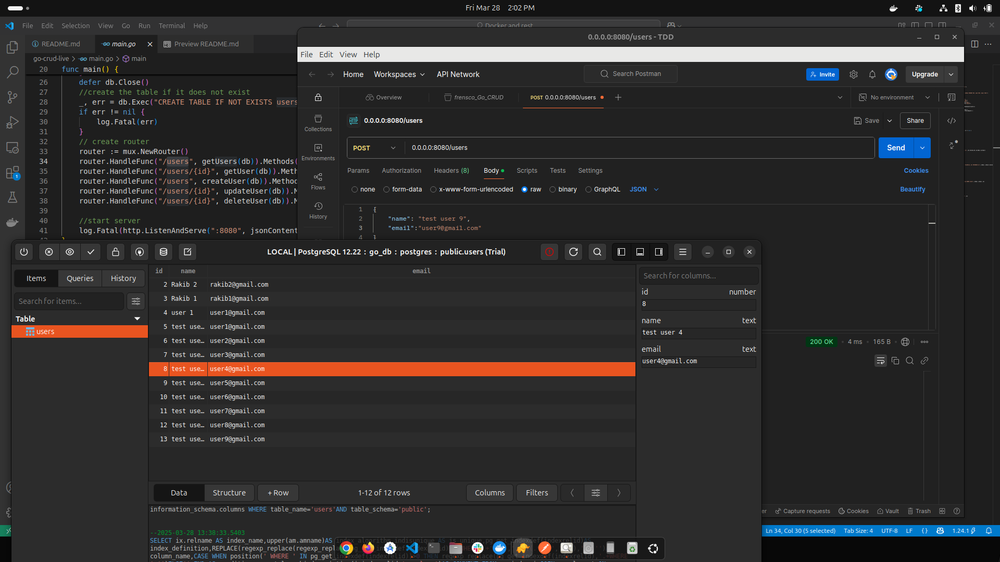

# CRUD operation in Go and PostgreSQL

## This project is containarized with Docker As there is only CRUD operation I have put all operation and routes in only the main file
  
 
 

## File structure

    
    ├── go-crud-live
    │   ├── main.go
    │   ├── Dockerfile
    │   ├── docker-compose.yml

     


## APIS


  **1.  Create a user :**
```bash
curl -X POST http://0.0.0.0:8080/users \
 -H "Content-Type: application/json" \
  -d '{
    "name": "test name",
    "email": "test@example.com",
}'
```

It will return something like:
```bash
Status: 201 Created
...
{
  "name": "test name",
  "email": "test@example.com",
}
```

**2 Fetch all User informations:**
```bash
curl -X GET 0.0.0.0:8080/users
```
It will return something like:
```bash
Status: 200 OK
[
    {
        "id": 1,
        "name": "user 1",
        "email": "user1@gmail.com"
    },
     ............
    ]
```

**3 Fetch one User base on ID:**
```bash
curl -X GET 0.0.0.0:8080/users/<id>
```
It will return something like:
```bash
Status: 200 OK
...
{
    "id": id,
    "name": "user name",
    "email": "user's email"
}
```


 

**4 Update User informations:**
```bash
curl -X PUT http://0.0.0.0:8080/users/<id> \
    -d '{
    "name": "updated name",
    "email": "updated email",
}'
```
And you will get:
```bash
Status: 200 OK
...
{
    "id": 0,
    "name": "updated name",
    "email": "updated email"
}
```


 **5 Delete user data:**

```bash
curl -X DELETE http://0.0.0.0:8080/users/<id> 
      
```
And you will get:
```bash
Status: 200 OK
...
{
 "User deleted"
}
```


 

 
</br>

 
 


 

## Run Locally

Clone the project

```bash
  git clone https://github.com/abdulawalarif/go-crud-live.git
```

Go to the project directory

```bash
  cd go-crud-live
```

Install dependencies

```bash
  docker-compose up --build
```


## How to tweak this project for your own uses
* **Run the project:** Insert some data for testing..


 
## Author

- [@abdulawalarif](https://github.com/abdulawalarif) 
  
## License


The MIT License [MIT](https://choosealicense.com/licenses/mit/). Please view the [License](LICENSE) File for more information.